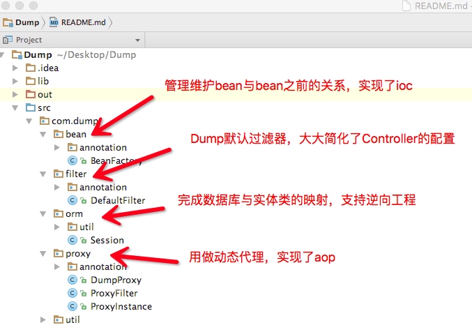
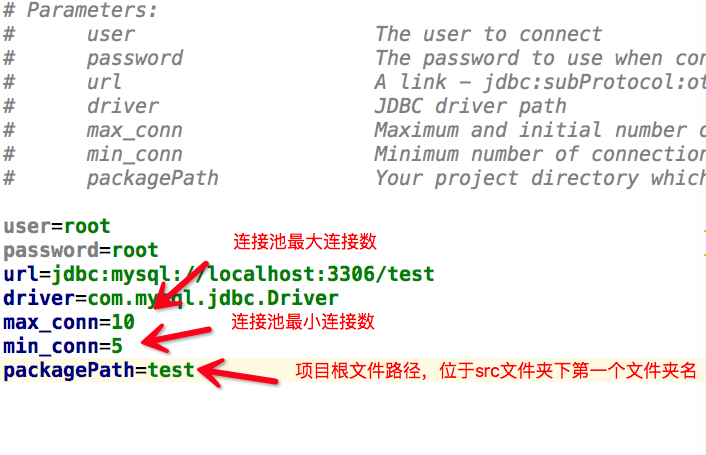

## Dump－轻量级mvc框架

### Info

Dump是一个轻量级mvc框架, 正如它的名字一样, Simple is everything.Dump是一个完全基于注解开发的
框架, 他甚至没有自己的xml文件,一切基于注解。Dump的灵感来源与Spring mvc, Hibernate和Spring, 
所以操作上可能找到很多它们的影子。同样,依据Spring mvc, Hibernate和Spring, Dump也分为三个模块,
它们各执其责, 相互配合完成整个工作。

### Structure



### How To Use

#### jar包下载

你可以clone本项目到你的路径下, 也可以导入jar包, [点此下载](),除了项目本身的jar包,项目还依赖于
`cglib.jar`和`asm.jar`用于实现动态代理。其jar包文件在本仓库lib文件夹下,可直接下载。

#### 配置文件

项目唯一需要你配置的就是数据库的配置文件, 配置文件名为`jdbc.properties`,位于src目录下,配置项如下。



当然`web.xml`文件也要配置为Dump默认的Filter,代码如下
```
    <servlet>
        <servlet-name>dump</servlet-name>
        <servlet-class>com.dump.filter.DefaultFilter</servlet-class>
        <load-on-startup>1</load-on-startup>
    </servlet>
    <servlet-mapping>
        <servlet-name>dump</servlet-name>
        <url-pattern>*.action</url-pattern>
    </servlet-mapping>
```
好了,只需两个步骤,你已经完成了Dump所需的所有配置工作,下面来看看如何使用吧!

### Controller

和Spring mvc用法几乎相同, 使用`@Controller`来表示它是一个控制器类,`@RequestMapping`用于匹配它的`url`,
`@Param`用于匹配表单的name值,当然,和Spring mvc一样, 你也可以直接传人具体类来自动填充属性值。下面展示了这三个
基本注解的使用。
```
@Controller
public class TestController {
    @RequestMapping("/a")
    public String login(Student student,@Param("name")String name, HttpServletRequest request){
        studentService.test();
        return "/index.jsp";
    }
}
```

### ORM

对于对象关系映射, Dump也提供了基本的函数操作, 包括分页操作, 而相对复杂的查询工作还是依赖于sql语句,但再也不用你来创建对象了,
这位你节省下很大的工作量。基本函数如有:`save()`, `delete()`, `update()`, `load()`, `getCount()`, `getAll()`, `selectBysql()`, 
`selectByPage()`。其中的用法,形参,实现功能和Hibernate完全一致,在此不做赘述。


 
